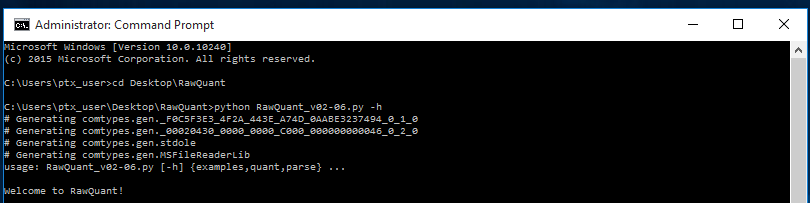

## RawQuant 

This guide describes the install and use of RawQuant. This guide was updated last on March 22, 2018. 

#### System Pre-Requisites

Our starting point is a blank Windows system. We recommend uninstalling MSFileReader and Python if they are already installed as the order of installation is important for RawQuant.

RawQuant does not have any specific system requirements, although the script may run slowly on older machines. The computer we are using in this walkthrough has the specs:

* Microsoft Windows 10 Enterprise 2015 LTSB
* 10.0.10240 Build 10240
* Optiplex 7040
* x64-based PC
* Intel(R) Core(TM) i7-6700 CPU @ 3.40GHz, 3408 Mhz, 4 Core(s), 8 Logical Processor(s)
* Installed Physical Memory (RAM)	8.00 GB

#### Downloads

Before starting, we recommend creating a working directory somewhere you will remember, and downloading some files to it. 

1. Download the RawQuant GitHub repository.
	* Navigate to the [RawQuant GitHub repository](https://github.com/kevinkovalchik/RawQuant) in your web browser.
	* This will include the Python bindings with MSFileReader.py.
	* Download the entire repository as a ZIP archive using the 'Clone or download' button. 
	* Extract the ZIP archive in the folder you created above.

	

2. Download Python into your created folder.
	* The version here is important. We have currently only tested version 3.6.1 (64-bit).
	* The install file can be downloaded from [Python directly](https://www.python.org/downloads/release/python-361/). 
	* Scroll down on the above page and click the appropriate release for your system. In this case, we are going to download the Windows x86-64 executable installer version.
	
	

3. Download the comtypes library for Python.
	* The version here is important (want version 1.1.3). 
	* The install file can be downloaded from [Python directly](https://pypi.python.org/pypi/comtypes/1.1.3) into the directory you created earlier.

4. Download MSFileReader into your created folder.
	* The version here is important. We have currently only tested the mentioned version (version 3.0.29, or 3.0 SP2).
	* The install file can be downloaded from [Thermo](https://thermo.flexnetoperations.com/control/thmo/login?nextURL=%2Fcontrol%2Fthmo%2Fdownload%3Felement%3D6306677). This website requires registration, which is free.
	* Alternatively, the install file can be downloaded from the [RawQuant GitHub page](https://github.com/kevinkovalchik/RawQuant).

#### Installation

Let's walk through the setup:

1. Navigate to your folder containing all the downloaded files using your file browser.

2. Install Python by double clicking the downloaded executable. Use the default "Install Now" option. You should see the screen below when it completes successfully.
	
	
	
3. Setup Python in the environment variables.
	* First find where Python was installed. You can use the Windows search function to look for the 'python.exe' file.
	
	
	
	* Now that we have the path, we want to add it to the environment.
	* Go to 'Control Panel'.
	* Click 'System and Security'.
	* Click 'System'.
	* Click 'Advanced System Settings'.
	* Click 'Environment Variables'.
	* In the upper box with the PATH entry highlighted, click 'Edit'.
	* Add the directory of the 'python.exe' file to the PATH variable.	
	
	

4. Add pip to the environment variables as well using the same process. 
	* the pip file is typically located in the same python directory in a 'Scripts' folder.

	

5. Check that Python and pip are installed correctly.
	* Open 'Command Prompt'. If you cannot find command prompt, just search for it in Windows.
	* Type 'python --version'.
	* Type 'pip --version'.

	

6. Install the comtypes package.
	* Open 'Command Prompt' if not already open.
	* Type 'pip install 'directory path to comtypes.zip file'.
	* After the install has completed successfully, restart your computer. 

	
 

7. Install MSFileReader version 3.0 SP2, 64-bit only (do not install the 32-bit version!).
	* Use the default settings for the install, specifying the 64-bit version only. 
	* After the install has completed successfully, restart your computer.

8. Install the other Python dependencies.
	* Open 'Command Prompt'.
	* Install dependencies using the command 'pip install 'package name''. For example:
	
	~~~bash
	pip install pandas
	~~~	
	
	* Repeat for packages numpy, pandas, tqdm, joblib, argparse.

	

9. Copy the MSFileReader.py file from the RawQuant GitHub directory you downloaded earlier to the Python 'Lib' directory.
	* Simply copy and paste MSFileReader.py into the Python Lib directory.
	* The Lib directory will be in the Python directory you mapped to the environment previously.  

	

#### Install testing

1. Check if RawQuant works.
	* Open 'Command Prompt'.
	* Navigate in command prompt to the directory where you have stored the RawQuant.py script. If you are unfamiliar with navigating folders with command prompt, there are many great tutorials online for helping with this. 
	* Make sure you have administrator priveleges at this point. The first time you run RawQuant, the comtypes package needs to build a couple of sub-libraries. After you have run it the first time, you no longer need admin priveleges. In the image below, note the comtypes 'generating' lines. This will only happen the first time you run RawQuant.
	* Enter the command below into the terminal and hit enter.

	~~~bash
	python RawQuant.py -h
	~~~
	
	

2. Test RawQuant on a real raw file to see if it is working completely. 
	* Download a test raw file from the EBI PRIDE repository for RawQuant (https://www.ebi.ac.uk/pride/archive/projects/PXD008787) or use your own raw file.
	* Test the raw file (in this example I tested an MS2 and SPS-MS3 file).

	~~~bash
	python RawQuant.py parse -f <path to your raw file> -o 2
	~~~
 
 	
 	
 	~~~bash
	python RawQuant.py quant -f <path to your raw file> -r TMT10 -i
	~~~
 
 	

3. If everything has worked properly, the commands should finish without error, and text output files should be generated in the same directory where the processed raw file(s) is located. 

#### Processing Files with RawQuant

This section will walk through some common commands and input scenarios for RawQuant as well as discussing some of the output data. 

1. Download a test raw file from the EBI PRIDE repository for RawQuant (https://www.ebi.ac.uk/pride/archive/projects/PXD008787) or use your own raw file.
2. Navigate to the directory where you have stored the RawQuant.py script
3. To invoke the general help for RawQuant use the command:

	~~~bash
	python RawQuant.py -h
	~~~

4. To invoke the help for the specific parse and quant functions, use extensions of the previous command.

	~~~bash
	python RawQuant.py parse -h
	
	python RawQuant.py quant -h
	~~~

5. These help boxes are worth reading and cover a lot of the basic usage and commands with RawQuant. 
6. If you are ever confused about input files for things like 'custom reagents', use the examples functionality of RawQuant to generate some files for you to use as a guide.

	~~~bash
	python RawQuant.py examples -h
	~~~

7. Let's perform our own analysis. I am going to use a file acquired on an Orbitrap Fusion downloaded from the above PRIDE repository that was acquired as MS1-Orbitrap HCD-MS2-Orbitrap. The file name is "ch 29Sept2017 eColi-31907 TMT11 MS2 1.raw" if you would like to follow along with the same file.
8. First lets process this file using the 'parse' functionality of RawQuant. There are multiple flags that the parse command can use as input.
	* '-f' this is the input file, or a list of files separated by spaces.
	* '-m' this can be used to specify a text file that contains multiple input files to be processed. One per line.
	* '-o' this specifies the MS orders to be parsed. Can be one number (e.g. -o 2) or a list separated by spaces (e.g. -o 1 2 3). If -o is set to 0, no parsing will be done. This last functionality is potentially desirable if you are looking to only generate an MGF output. If you input a list of values that contains 0 (e.g. 0 1 2), no parsing will be done.
	* '-mgf' this flag will trigger MGF generation.
	* '-spd' this will suppress the progress bar during processing. But this is cool to look at, so why would you do that?

	~~~bash
	python RawQuant.py parse -h
	~~~

9. I am interested in generating parsed output for MS1 and MS2 scans in my raw file, as well as creating an MGF output I can use in a database search.

	~~~bash
	python RawQuant.py parse -f C:\Users\ptx_user\Desktop\RawQuant\ch_29Sept2017_eColi-31907_TMT11_MS2_1.raw -o 1 2 -mgf
	~~~

10. Once processing is complete, you should see four files created in the same directory as the raw file.
	* a 'metrics.txt' file - this contains some general metrics of the raw file, such as number of MS1 scans, topN rate, duty cycle.
	* 'MS1ParseData.txt' and 'MS2ParseData.txt' files - these contain the metrics for every MS1 and MS2 scan found in the raw file. 
	* 'MGF.mgf' file - this is a standard MGF output. Use with any search engine who will take MGF input!
 
11. Let's look at the output files a little closer at each of the files. They are tab delimited text files, so they can be opened in most editors and Excel.
12. Let's look at the 'metrics.txt' file first. This contains some useful 'quick-glance' information.
	* The MS order value denotes the level where MS2 data was acquired. 
	* Total scans denotes the total number of scans in the entire file.
	* MS1 scans counts the number of MS1 scans.
	* MS2 scans counts the number of MS2 scans.
	* Mean topN is the average number of MS2 events triggered in an MS1 scan across the entire run.
	* MS1 scans/sec counts the number of MS1 scans that occurs every second.
	* MS2 scans/sec counts the number of MS2 events that are triggered every second.
	* Mean duty cycle calculates the time (in seconds) between neighbouring MS1 events.  

	

13. What about the 'MS1ParseData.txt' file. 
	* ScanNumber is the scan index for the MS1 event.
	* RetentionTime is the retention time (in minutes) of the MS1 event.
	* MS1IonInjectionTime is the injection time (in ms) for the MS1 event.

	

14. What about the 'MS2ParseData.txt' file. This contains a lot of information.
	* ScanNumber is the scan index for the MS2 event.
	* MS1ScanNumber is the MS1 event that the MS2 scan was triggered from.
	* RetentionTime is the retention time (in minutes) where the MS2 scan was acquired. 
	* PickedRetentionTime is the retention time (in minutes) where the MS2 ion was targeted for acquisition (so, this is the retention time of the MS1 scan event that it was triggered from).
	* PeakMaxRetentionTime is the retention time (in minutes) where the maximum intensity for the parent ion selected for MS2 analysis was observed. 
	* PrecursorMass is the m/z of the parent ion selected for MS2.
	* PrecursorCharge is the determined charge state of the parent ion selected for MS2.
	* PrecursorPickedIntensity is the intensity of the precursor ion in the MS1 scan closest to where the MS2 scan was carried out (just prior).
	* PrecursorMaxIntensity is the maximum observed intensity across the elution profile for the parent ion selected for MS2.
	* PrecursorArea is the detected area across the elution profile for the parent ion selected for MS2.
	* PrecursorRetentionWidth is the width of the elution profile for the parent ion.
	* MS1IonInjectionTime is the injection time (in ms) of the MS1 scan where the MS2 event was triggered from.
	* MS2IonInjectionTime is the injection time (in ms) of the MS2 scan event itself. 

	

15. Let's move on to processing a quant file. For this example I am going to use a file that was obtained using an SPS-MS3 approach on an Orbitrap Fusion from the above PRIDE repository that was acquired as . The file name is "ch 29Sept2017 eColi-31907 TMT11 2e5-120 1.raw" if you would like to follow along with the same file.
16. First lets process this file using the 'quant' functionality of RawQuant. There are multiple flags that the quant command can use as input.
	* '-f' this is the input file, or a list of files separated by spaces.
	* '-m' this can be used to specify a text file that contains multiple input files to be processed. One per line.
	* '-r' this is the labeling reagents. Built-in options are TMT0, TMT2, TMT6, TMT10, TMT11, iTRAQ4, and iTRAQ8.
	* '-cr' this is if you want to use custom reagents. Should be a csv file containing user-defined labels and masses. To see an example, use the command 'python RawQuant.py examples -r'.
	* '-i' this will trigger quantification of isolation interference.
	* '-o' this specifies the MS order where the quantification values are. Can be one number (e.g. -o 2). This flag is optional. If not input, the highest MS order will be assumed. Possible values are 2 and 3. 
	* '-mgf' this flag will trigger MGF generation.
	* '-spd' this will suppress the progress bar during processing. 
	* '-c' this will correct for isotopic impurities in the reagents. Input should be a csv file containing an impurity matrix. For an example, try 'python RawQuant.py examples -c'. 

	~~~bash
	python RawQuant.py quant -h
	~~~

17. I am interested in generating quant output for MS3 scans in my raw file, as well as creating an MGF output I can use in a database search.

	~~~bash
	python RawQuant.py quant -f C:\Users\ptx_user\Desktop\RawQuant\ch_29Sept2017_eColi-31907_TMT11_2e5-120_1.raw -r TMT10 -i -mgf
	~~~

18. Once processing is complete, you should see three files created in the same directory as the raw file.
	* a 'metrics.txt' file - this contains some general metrics of the raw file, such as number of MS1 scans, topN rate, duty cycle, just as before.
	* 'QuantData.txt' - this contains the quantification and scan data for the MS3 events. 
	* 'MGF.mgf' file - this is a standard MGF output. Use with any search engine who will take MGF input!

19. Let's look a little closer at the 'QuantData.txt' file. It contains a lot of information. 
	* ScanNumber is the scan index for the MS3 event.
	* MS2ScanNumber is the MS2 event that the MS3 scan was triggered from.
	* MS1ScanNumber is the MS1 event that the MS2 scan that led to the MS3 was triggered from.
	* RetentionTime is the retention time (in minutes) where the MS3 scan was acquired. 
	* PickedRetentionTime is the retention time (in minutes) where the MS2 ion was targeted for acquisition (so, this is the retention time of the MS1 scan event that it was triggered from).
	* PeakMaxRetentionTime is the retention time (in minutes) where the maximum intensity for the parent ion selected for MS2 analysis was observed. 
	* PrecursorMass is the m/z of the parent ion selected for MS2.
	* PrecursorCharge is the determined charge state of the parent ion selected for MS2.
	* PrecursorPickedIntensity is the intensity of the precursor ion in the MS1 scan closest to where the MS2 scan was carried out (just prior).
	* PrecursorMaxIntensity is the maximum observed intensity across the elution profile for the parent ion selected for MS2.
	* PrecursorArea is the detected area across the elution profile for the parent ion selected for MS2. Note, this is not done by curve fitting. 
	* PrecursorRetentionWidth is the width of the elution profile for the parent ion.
	* MS1IonInjectionTime is the injection time (in ms) of the MS1 scan where the MS2 event was triggered from.
	* MS2IonInjectionTime is the injection time (in ms) of the MS2 scan event.
	* MS3IonInjectionTime is the injection time (in ms) of the MS3 scan event.
	* MS1Interference in the amount of signal in the isolation window that is not from the selected precursor (represented as a percent).
	* tmt126_mass is the observed mass for the specified TMT reporter ion.
	* tmt126_ppm is the error (in ppm) of the observed mass vs. the expected reporter ion mass.
	* tmt126_intensity is the observed intensity of the reporter ion.
	* tmt126_res is the observed resolution of the reporter ion.
	* tmt126_bl is the observed background signal of the reporter ion.
	* tmt126_noise is the Orbitrap pre-amplifier noise for the reporter ion.
	* SPSMass are the masses of the ions selected from the MS2 scan for SPS-MS3 analysis.
	* SPSIntensity are the intensities of the selected SPS ions. 

	

####Using the RawQuant output in your analysis

There are numerous ways you can capitalize on the data output from RawQuant. For some code examples that process RawQuant output and combine them with search results from PeptideShaker, please see the GitHub associated with the RawQuant manuscript (https://github.com/chrishuges/RawQuant_JPR-2018). There are a wide variety of RNotebook code snippets here that can be followed for doing numerous analyses. Potential analysis pipelines of RawQuant data include:

* Parse your data file with RawQuant. Use the generated 'metrics' file to measure the performance of your MS across a wide variety of acquisition parameters, or monitor the performance over time.
* Parse your data file with RawQuant and generate an MGF. Process the MGF using a search tool that accepts MGF input (e.g. Mascot, SearchGUI...and many other search engines). Use the MS2 scan numbers of the peptide matches to combine with the parsed RawQuant data (ScanNumber column in RawQuant). Check the metrics of the peptides that were identified, are you always hitting the max injection time for MS2? Can you afford to scan faster? Or do you need to go slower?
* Quantify your data file with RawQuant and generate an MGF. As before, search your data using any program that will take an MGF input. Now you have many options:
	* Combine the quant and search output using ScanNumbers, just as before. PeptideShaker, for example, outputs these by default in the peptide spectral match output, as does Proteome Discoverer. Process your data in R using some of the code mentioned above.
	* Input your quantification matrix into MSnbase (R) and process in combination with your modifications data.
	* Use the MGF file alone in Isobar (R) to gather quantification and identification data.
	* Use another tool I don't know about to do the same thing! The open source nature of RawQuant here gives you many options. Test and choose what works best for your own sample analysis!

Let's look at an example for combining the RawQuant data with search engines.

1. In the RawQuant manuscript, we used SearchGUI and PeptideShaker a lot. As you saw above, the RawQuant output always contains the columns 'ScanNumber', or 'MS2ScanNumber', 'MS1ScanNumber' and so on. 
2. PeptideShaker can output a variety of reports. The one we are interested in for combination is the 'Default PSM Report'.

	

3. As you can see, there is a lot of information here. Unfortunately, at the moment, the scan number is a bit messed up because of the MGF format of RawQuant (known bug), but this information is still accessible from the 'Spectrum Title' column.

	

4. Using R, Python, or your language of choice, you can combine the RawQuant output with the PeptideShaker results by combining this spectrum number with the appropriate column from RawQuant.
	* For a parsed file where -o 2 was used, this will be the 'ScanNumber' column.
	* for a quant file where quant was in MS2, this will be the 'ScanNumber' column.
	* for a quant file where the quant was SPS-MS3, this will be the 'MS2ScanNumber' column.

5. For combining with other search engines, you simply need to locate the output file that contains the MS2 scan number of a given peptide spectral match, or peptide match and align this with the same values in the RawQuant tables. 
	* In MaxQuant, this data is available in the 'peptides.txt' output file.
	* In the Trans-Proteomic Pipeline, this data can be made available in the PeptideProphet output. 
	* In Proteome Discoverer, this data is available in the PSM report. 

What about using the RawQuant output for other tools?

1. As mentioned above, the quantification matrices can be directly input into R or Python (or any other tools that accept tab delimited text files. 
	* You can use the quantification data as input to a wide variety of R packages that take expression data, such as microarray tools like Limma, or VSN.
	* Perform differential abundance analysis of the peptides using R packages like Limma or PECA.  
	* You can also use the data as input for other packages that are more proteomics focused, such as MSnbase. 

2. The MGF output can be used as input to a variety of pipelines based in R or Python.
	* Use the MGF output as a basis for quantification and identification using Isobar.
	* Perform database matching with the MGF using packages such as rTandem and MSGFplus. 

3. The parsed data can also be directly input into R and Python to perform your own calculations of topN, scan rate, ID rate, etc...
	* Use the R code guides fround on https://github.com/chrishuges/RawQuant_JPR-2018 to get ideas and help.
	* Design your own code to track instrument performance over time based on parsed data.

The massive number of tools available to proteomics researchers now means that you can combine RawQuant data with virtually any sort of analysis pipeline. The specifics will depend on the software tools you are using, and the data made available by these packages. 

####Final notes

RawQuant is in active development. We hope to have a GUI-based version sometime in the near future. If you have any issues, or have encountered a bug, or there is a feature you would really like to see, please do not hesitate to contact Kevin Kovalchik (kkovalchik@bcgsc.ca) or Christopher Hughes (chughes@bcgsc.ca), and we will do our best to get you using our tool!
